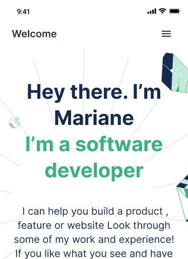

# Microverse Portfolio

> This project is dedicated to microverse. It is a task to create a mini website for mobile
- The chosen template is N°3

This project contains, linter testings html files designed through styles.css

## Built With

- HTML
- CSS

## Live Demo

[Live Demo Link](https://aminehlub.github.io/Microverse-Portfolio/)

## Getting Started

### Prerequisites

- Internet Connection

- OS with Git installed on it

### Setup

**Run** git clone https://github.com/AmineHLub/Microverse-Portfolio.git

### Install

no installation required

### Usage

This is a mini project (index.html)

### Run tests

**Run** index.html

## Author

👤 **Author**

- GitHub: [@AmineHLub](https://github.com/AmineHLub)
- Twitter: [@Amino47612441](https://twitter.com/Amino47612441)
- LinkedIn: [LinkedIn](https://www.linkedin.com/in/mohamed-amine-hajltaief-b18863163/)

## 🤝 Contributing

Contributions, issues, and feature requests are welcome!

Feel free to check the [issues page](../../issues/).

## Acknowledgments

- Hat tip to Microverse whose code was used
- This project is only a clone to Microverse's template from Figma

## 📝 License

This project is [MIT](./MIT.md) licensed.
